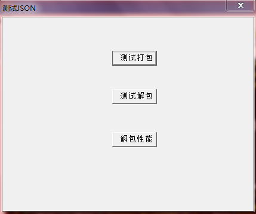
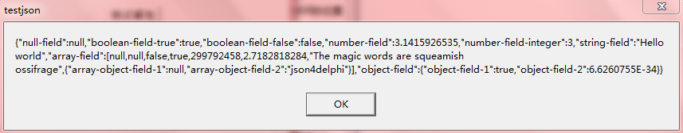
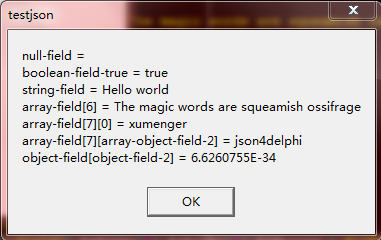
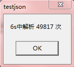

## 关于json4delphi

一个使用Delphi实现的JSON打包解包类

关于JSON格式，可以阅读[http://www.w3school.com.cn/json/](http://www.w3school.com.cn/json/)

关于json4delphi，可以阅读[http://blog.csdn.net/rilyu/article/details/35804517](http://blog.csdn.net/rilyu/article/details/35804517)

## 测试json4delphi

测试程序打开后界面如下

点击【测试打包】

点击【测试解包】

点击【解包性能】，6s的时间，按照测试程序中的方式，解析49817次

